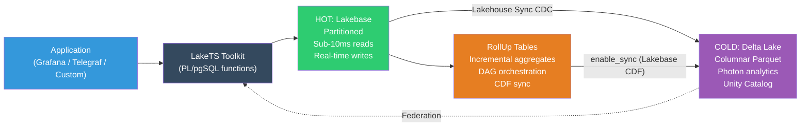

# LakeTS - Time Series Toolkit for Databricks Lakebase

[](https://github.com/databricks-solutions/lakets/actions/workflows/ci.yml)
[](https://github.com/databricks-solutions/lakets/releases/latest)
[](./LICENSE.md)
[](#)
[](./tests)

LakeTS is a time series toolkit for Databricks Lakebase — pure SQL (PL/pgSQL) functions with a hot tier (Lakebase) + cold tier (Delta Lake) hybrid architecture. No custom extensions required.

## Features

| Feature | Description |
|---------|-------------|
| **ChronoTables** | Automatic time-based partitioning with `create_chronotable()` |
| **Multi-Metric Tables** | InfluxDB-style tag + field model with `create_metric_table()` |
| **Time Series Functions** | `time_bucket`, `first`, `last`, `locf`, `interpolate`, `delta`, `rate`, `histogram` |
| **Gap-filling** | `time_bucket_gapfill` + LEFT JOIN for continuous time series |
| **RollUp Engine** | Incremental aggregates with per-bucket refresh, invalidation tracking, cold-tier re-aggregation, chunk-skip pruning, batch refresh, DAG orchestration, and Delta export |
| **Tiering** | Policy-based eviction of cold partitions from Lakebase once CDF has flushed them to the Unity Catalog Managed Table |
| **Retention** | Automated data lifecycle management across both tiers |
| **Lakehouse Sync** | CDC-based replication to Delta via shadow table pattern |
| **Last Value Cache** | Sub-10ms latest-state queries via `enable_lvc()` |
| **Cardinality Management** | Tag cardinality explorer + threshold checks |
| **Alert Rules** | SQL-native `alert_check()` + `alert_deadman()` on hot data |
| **Bulk Ingest** | `ingest_batch()` for JSONB arrays + `ingest_prometheus()` |
| **Downsampling Registry** | Multi-resolution pipeline metadata + `query_auto_resolution()` |
| **Unity Catalog Sync** | Mirror ChronoTables and RollUps to Unity Catalog via Lakebase CDF (`enable_sync`) |
| **Monitoring** | Prometheus-compatible metrics endpoint |
| **Benchmarks** | TSBS-adapted benchmark suite |

## Install

### Option A: Single-file install (recommended)

Download the latest release from [GitHub Releases](https://github.com/databricks-solutions/lakets/releases):

```bash
# Download latest release
curl -LO https://github.com/databricks-solutions/lakets/releases/latest/download/lakets.sql

# Verify checksum
curl -LO https://github.com/databricks-solutions/lakets/releases/latest/download/lakets.sql.sha256
sha256sum -c lakets.sql.sha256

# Install on Lakebase
psql -h <host> -U <user> -d <database> -f lakets.sql
```

### Option B: From source

```bash
git clone https://github.com/databricks-solutions/lakets.git
cd lakets
psql -h <host> -U <user> -d <database> -f sql/99_install.sql
```

### Option C: Via psycopg2 (Databricks notebooks)

```python
import psycopg2
conn = psycopg2.connect(host="<host>", user="<user>", dbname="<database>",
                        password="<token>", sslmode="require")
conn.autocommit = True
with open('lakets.sql') as f:
    conn.cursor().execute(f.read())
```

### Check installed version

```sql
SELECT version, installed_at, modules FROM lakets._version ORDER BY installed_at DESC LIMIT 1;
```

### Uninstall

```bash
psql -h <host> -U <user> -d <database> -f sql/00_uninstall.sql
```

### Migrate from v0.1.0 to v0.1.1

If you already have LakeTS v0.1.0 installed, use the migration runner instead of a full reinstall:

```bash
psql -h <host> -U <user> -d <database> -f sql/migrate.sql
```

The migration runner detects your installed version and applies only pending migrations. All migrations are idempotent — safe to re-run. After migration, verify with:

```sql
SELECT version, installed_at FROM lakets._version ORDER BY installed_at;
```

## Quick Start

```sql
-- Create a ChronoTable (single-metric)
CREATE TABLE metrics (time TIMESTAMPTZ NOT NULL, device TEXT, cpu FLOAT8);
SELECT lakets.create_chronotable('metrics', 'time', '1 day');

-- Or create a Multi-Metric ChronoTable (InfluxDB-style)
SELECT lakets.create_metric_table('system_metrics',
    ARRAY['host','region'], ARRAY['cpu','memory','disk_io'], '1 day');

-- Query with time series functions
SELECT lakets.time_bucket('1 hour'::interval, time) AS hour,
       avg(cpu), lakets.first(cpu, time), lakets.last(cpu, time)
FROM metrics GROUP BY 1 ORDER BY 1;

-- Enable Last Value Cache (sub-10ms latest state)
SELECT lakets.enable_lvc('system_metrics', ARRAY['host'], ARRAY['cpu','memory']);

-- Set up lifecycle policies
SELECT lakets.add_tiering_policy('metrics', '7 days');
SELECT lakets.add_retention_policy('metrics', '30 days');
```

## Architecture



## Project Structure

```
sql/               -- SQL modules (install on Lakebase)
tests/             -- SQL + Python test suites (146 tests)
databricks/        -- Workflow jobs + Asset Bundle
.github/workflows/ -- CI (PR checks) + Release (tag → GitHub Release)
docs/              -- Documentation
demo/              -- Financial demo with data generator
requirements.txt   -- Python dependencies for workflows
```

## Documentation

The canonical documentation lives in the [`website/`](./website/) directory and is published as a Docusaurus site at https://databricks-solutions.github.io/lakets/.

Direct links:

- [Getting Started](./website/docs/guides/getting-started.md) — install, create ChronoTables, query.
- [How It Works](./website/docs/guides/how-it-works.md) — internals, architecture diagrams.
- [Lakehouse Sync Setup](./website/docs/guides/lakehouse-sync-setup.md) — Delta Lake integration.
- [API Reference](./website/docs/reference/api-reference.md) — public function signatures.
- [Function Reference](./website/docs/reference/function-reference.md) — complete catalog (77 functions, 2 aggregates, 6 triggers, 9 metadata tables).

To preview locally:

```bash
cd website
npm install
npm start
```

## Observability Dashboards

LakeTS ships a pre-built **Databricks AI/BI dashboard** for monitoring your installation:

**File:** `demo/dashboards/lakets_monitoring.lvdash.json`

### Dashboard Pages

| Page | Panels |
|------|--------|
| **Partition Health** | Hypertable count, chunk counts by status (active/tiered/dropped), chunk health table per hypertable, estimated row counts |
| **RollUp Monitoring** | Stale RollUp counter, dirty bucket total, watermark lag bar chart per RollUp (colored by refresh mode), invalidation log depth, full RollUp status table |
| **LVC & System** | LVC-enabled table count, total cached series, database size (GB), LVC stats table, active policies by type |

### Importing into Databricks

1. In your Databricks workspace, go to **Dashboards**.
2. Click **Import** (top-right menu).
3. Upload `demo/dashboards/lakets_monitoring.lvdash.json`.
4. When prompted, select the **SQL warehouse** connected to your Lakebase instance.
5. Click **Publish** to make the dashboard available to your team.

### Data Sources

All panels query live from Lakebase via the monitoring functions:

```sql
-- All operational metrics (Prometheus-compatible key-value rows)
SELECT * FROM lakets.lakets_metrics();

-- Per-hypertable chunk health summary
SELECT * FROM lakets.chunk_health();

-- LVC cache occupancy per table
SELECT * FROM lakets.lvc_stats();
```

The SQL warehouse must have network access to your Lakebase PostgreSQL endpoint.

### Recommended Refresh Schedule

Set the dashboard to **auto-refresh every 15 minutes** to align with the RollUp refresh job cadence.

---

## Contributing

PRs to `main` are validated by CI checks (SQL lint, Python lint, secret scan, unit tests). See `.github/workflows/ci.yml`.

## Requirements

- Databricks workspace with Lakebase
- PostgreSQL 16+ (Lakebase default)
- For workflows: Databricks cluster with Python dependencies (`pip install -r requirements.txt`)

