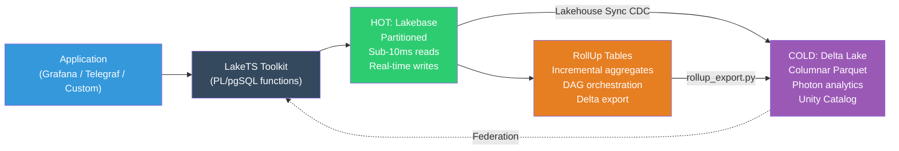

# LakeTS - Time Series Toolkit for Databricks Lakebase

LakeTS is a time series toolkit for Databricks Lakebase — pure SQL (PL/pgSQL) functions with a hot tier (Lakebase) + cold tier (Delta Lake) hybrid architecture. No custom extensions required.

## Features

| Feature | Description |
|---------|-------------|
| **ChronoTables** | Automatic time-based partitioning with `create_chronotable()` |
| **Multi-Metric Tables** | InfluxDB-style tag + field model with `create_metric_table()` |
| **Time Series Functions** | `time_bucket`, `first`, `last`, `locf`, `interpolate`, `delta`, `rate`, `histogram` |
| **Gap-filling** | `time_bucket_gapfill` + LEFT JOIN for continuous time series |
| **RollUp Engine** | Incremental aggregates with per-bucket refresh, invalidation tracking, cold-tier re-aggregation, chunk-skip pruning, batch refresh, DAG orchestration, and Delta export |
| **Compression & Tiering** | Policy-based tiering from Lakebase to Delta Lake |
| **Retention** | Automated data lifecycle management across both tiers |
| **Lakehouse Sync** | CDC-based replication to Delta via shadow table pattern |
| **Last Value Cache** | Sub-10ms latest-state queries via `enable_lvc()` |
| **Cardinality Management** | Tag cardinality explorer + threshold checks |
| **Alert Rules** | SQL-native `alert_check()` + `alert_deadman()` on hot data |
| **Bulk Ingest** | `ingest_batch()` for JSONB arrays + `ingest_prometheus()` |
| **Downsampling Registry** | Multi-resolution pipeline metadata + `query_auto_resolution()` |
| **Monitoring** | Prometheus-compatible metrics endpoint |
| **Benchmarks** | TSBS-adapted benchmark suite |

## Install

### Option A: Single-file install (recommended)

Download the latest release from [GitHub Releases](../../releases):

```bash
# Download latest release
curl -LO https://github.com/<owner>/LakeTS/releases/latest/download/lakets.sql

# Verify checksum
curl -LO https://github.com/<owner>/LakeTS/releases/latest/download/lakets.sql.sha256
sha256sum -c lakets.sql.sha256

# Install on Lakebase
psql -h <host> -U <user> -d <database> -f lakets.sql
```

### Option B: From source

```bash
git clone https://github.com/<owner>/LakeTS.git
cd LakeTS
psql -h <host> -U <user> -d <database> -f sql/99_install.sql
```

### Option C: Via psycopg2 (Databricks notebooks)

```python
import psycopg2
conn = psycopg2.connect(host="<host>", user="<user>", dbname="<database>",
                        password="<token>", sslmode="require")
conn.autocommit = True
with open('lakets.sql') as f:
    conn.cursor().execute(f.read())
```

### Check installed version

```sql
SELECT version, installed_at, modules FROM lakets._version ORDER BY installed_at DESC LIMIT 1;
```

### Uninstall

```bash
psql -h <host> -U <user> -d <database> -f sql/00_uninstall.sql
```

## Quick Start

```sql
-- Create a ChronoTable (single-metric)
CREATE TABLE metrics (time TIMESTAMPTZ NOT NULL, device TEXT, cpu FLOAT8);
SELECT lakets.create_chronotable('metrics', 'time', '1 day');

-- Or create a Multi-Metric ChronoTable (InfluxDB-style)
SELECT lakets.create_metric_table('system_metrics',
    ARRAY['host','region'], ARRAY['cpu','memory','disk_io'], '1 day');

-- Query with time series functions
SELECT lakets.time_bucket('1 hour'::interval, time) AS hour,
       avg(cpu), lakets.first(cpu, time), lakets.last(cpu, time)
FROM metrics GROUP BY 1 ORDER BY 1;

-- Enable Last Value Cache (sub-10ms latest state)
SELECT lakets.enable_lvc('system_metrics', ARRAY['host'], ARRAY['cpu','memory']);

-- Set up lifecycle policies
SELECT lakets.add_compression_policy('metrics', '7 days');
SELECT lakets.add_retention_policy('metrics', '30 days');
```

## Architecture



## Project Structure

```
sql/               -- SQL modules (install on Lakebase)
tests/             -- SQL + Python test suites (146 tests)
databricks/        -- Workflow jobs + Asset Bundle
.github/workflows/ -- CI (PR checks) + Release (tag → GitHub Release)
docs/              -- Documentation
demo/              -- Financial demo with data generator
requirements.txt   -- Python dependencies for workflows
```

## Documentation

- [Getting Started](docs/getting_started.md) - Install, create ChronoTables, query
- [How It Works](docs/how_it_works.md) - Deep dive into internals with diagrams
- [API Reference](docs/api_reference.md) - All 70+ functions documented
- [Lakehouse Sync Setup](docs/lakehouse_sync_setup.md) - Delta Lake integration

## Contributing

PRs to `main` are validated by CI checks (SQL lint, Python lint, secret scan, unit tests). See `.github/workflows/ci.yml`.

## Requirements

- Databricks workspace with Lakebase
- PostgreSQL 16+ (Lakebase default)
- For workflows: Databricks cluster with Python dependencies (`pip install -r requirements.txt`)

