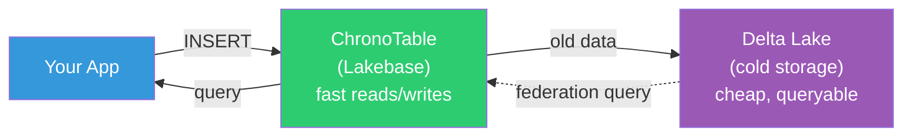
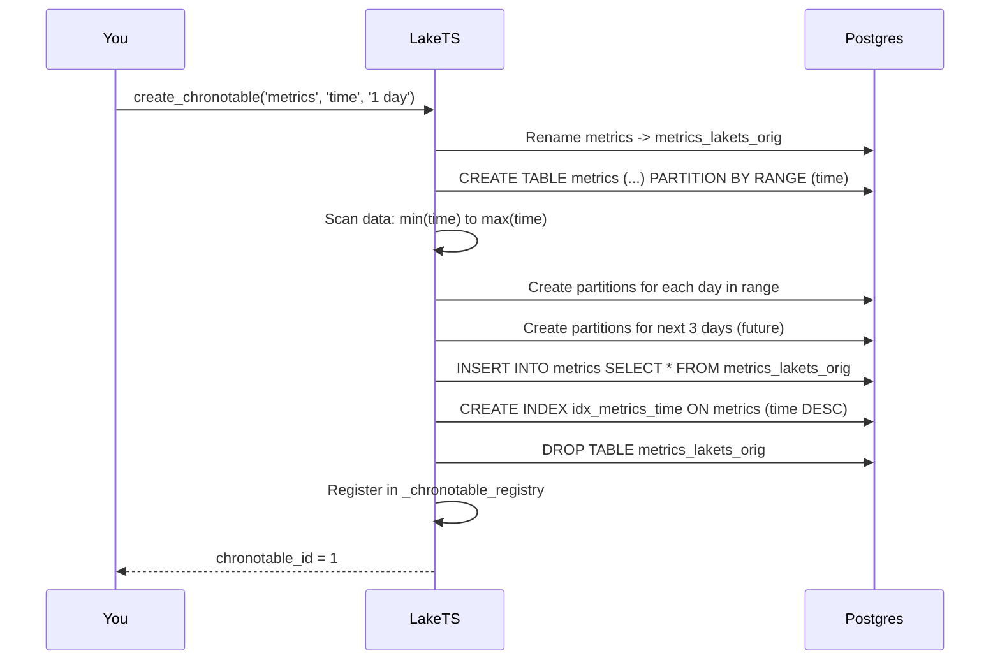
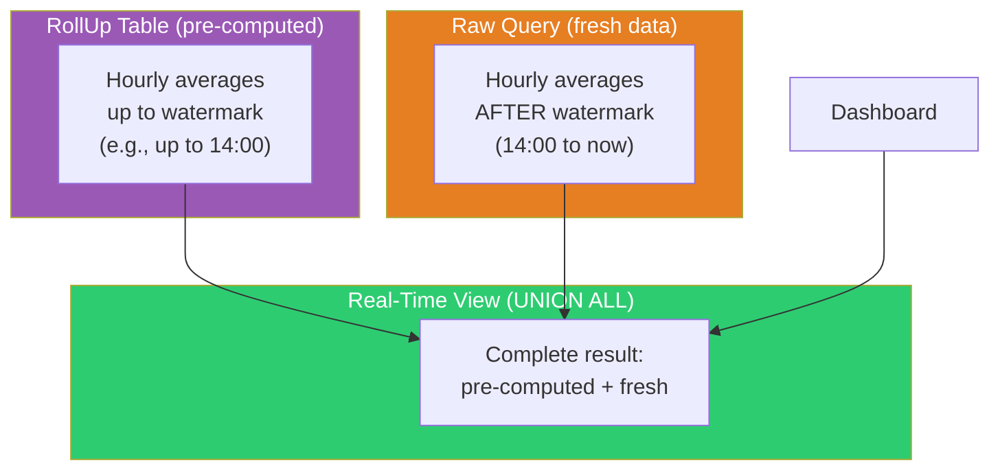
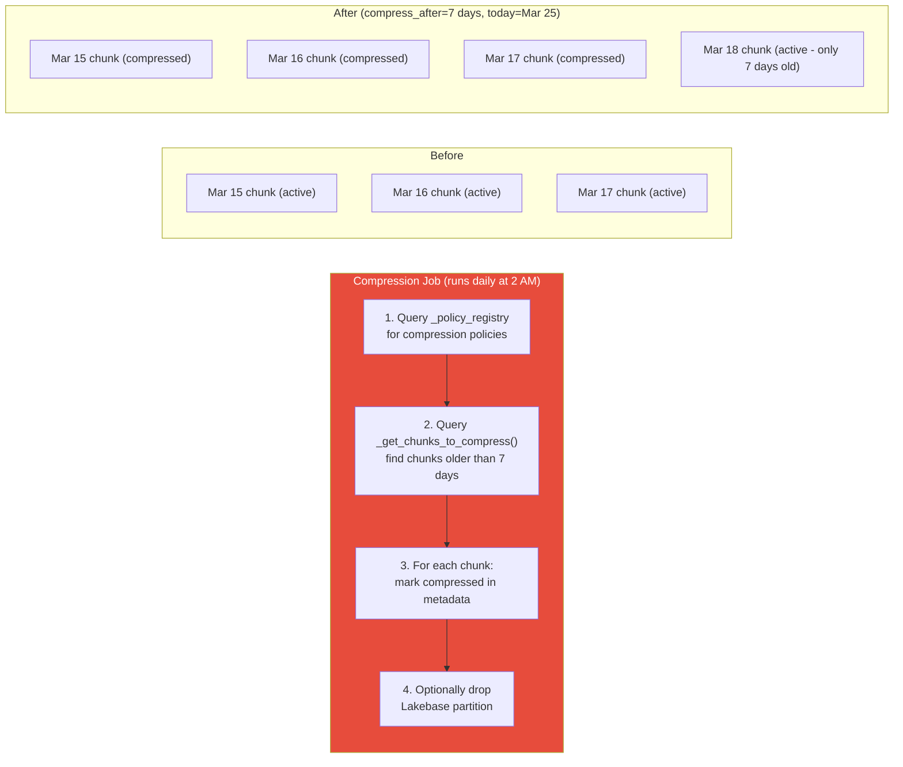
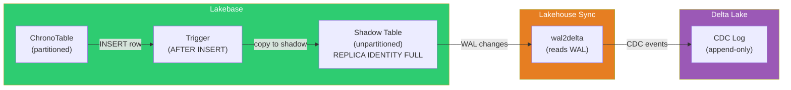
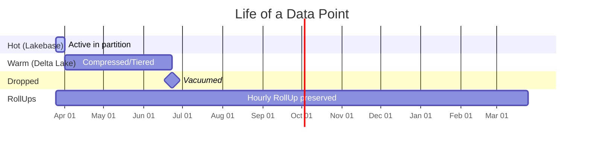

# How LakeTS Works

A deep dive into how LakeTS turns Databricks Lakebase into a full-featured time series database — explained simply.

---

## Table of Contents

1. [The Problem](#1-the-problem)
2. [The Big Picture](#2-the-big-picture)
3. [How ChronoTables Work](#3-how-chronotables-work)
4. [How Time Series Functions Work](#4-how-time-series-functions-work)
5. [How RollUps Work](#5-how-rollups-work)
6. [How Compression & Tiering Works](#6-how-compression--tiering-works)
7. [How Retention Works](#7-how-retention-works)
8. [How Lakehouse Sync Works](#8-how-lakehouse-sync-works)
9. [Life of a Data Point](#9-life-of-a-data-point-end-to-end)
10. [What Makes This Different from TimescaleDB](#10-what-makes-this-different-from-timescaledb)

---

## 1. The Problem

Imagine you're collecting temperature readings from 1,000 sensors every second. That's **86 million rows per day**. After a year, you have 31 billion rows.

Plain PostgreSQL struggles with this because:

- **Inserts slow down** as the table grows (indexes get huge)
- **Queries scan everything** even when you only want the last hour
- **No easy way to archive old data** without manual partition management
- **Common patterns** like "average temperature per hour with gap-filling" require complex SQL

Time series databases like TimescaleDB solve this by adding a layer on top of Postgres. LakeTS does the same thing — but for Databricks Lakebase, with the added benefit of tiering cold data to Delta Lake.

---

## 2. The Big Picture

LakeTS has two paths for your data:



| Path | Where | Speed | Cost | What lives here |
|------|-------|-------|------|-----------------|
| **Hot** | Lakebase (Postgres) | < 10ms | Higher | Recent data (days to weeks) |
| **Cold** | Delta Lake (Parquet) | 100ms-1s | Lower | Historical data (weeks to years) |

**The key insight**: Most time series queries care about recent data. By keeping only recent data in the fast Postgres layer and archiving the rest to Delta Lake, you get the best of both worlds.

---

## 3. How ChronoTables Work

### The Concept

A ChronoTable (called "hypertable" in V1) looks like a regular table but is secretly split into many smaller tables called **chunks** — one per time interval (e.g., one per day).

```
metrics (what you see)
  |
  +-- metrics_20260320_000000  (Mar 20 data)
  +-- metrics_20260321_000000  (Mar 21 data)
  +-- metrics_20260322_000000  (Mar 22 data)
  +-- metrics_20260323_000000  (Mar 23 data)  <-- today
  +-- metrics_20260324_000000  (Mar 24 data)  <-- pre-created for tomorrow
```

**Why chunks matter**:
- **Inserts are fast**: new data only touches the latest chunk, not the whole table
- **Queries are fast**: Postgres automatically skips chunks outside your time range (partition pruning)
- **Dropping old data is instant**: drop a chunk = drop a table (no slow DELETE)

### Under the Hood

When you call `create_chronotable('metrics', 'time', '1 day')`, here's what happens:



**Key detail**: LakeTS scans your existing data to figure out how far back partitions need to go. If your data spans 10 days, it creates 10 past partitions + 3-5 future ones.

### The Metadata

LakeTS tracks everything in two tables:

```sql
-- Which tables are ChronoTables?
SELECT * FROM lakets._chronotable_registry;
-- id | schema | table   | time_column | chunk_interval | compression_enabled | sync_enabled
-- 1  | public | metrics | time        | 1 day          | false               | false

-- What chunks exist?
SELECT * FROM lakets._chunk_metadata;
-- id | chronotable_id | chunk_name                    | range_start | range_end   | status
-- 1  | 1             | public.metrics_20260320_000000| 2026-03-20  | 2026-03-21  | active
-- 2  | 1             | public.metrics_20260321_000000| 2026-03-21  | 2026-03-22  | active
```

---

## 4. How Time Series Functions Work

LakeTS provides specialized SQL functions for common time series patterns. Here's how each one works internally.

### time_bucket — "Round timestamps to intervals"

**What it does**: Groups timestamps into fixed-width buckets. Like `date_trunc` but for any interval.

```sql
SELECT lakets.time_bucket('1 hour'::interval, '2026-03-25 14:37:22'::timestamptz);
-- Returns: 2026-03-25 14:00:00
```

**How it works internally**:
- For intervals shorter than a month (hours, minutes, days): delegates to Postgres's built-in `date_bin()` function — very fast
- For month/year intervals: custom math that counts months since an origin and rounds down

```
Input:  2026-03-25 14:37:22
        |
        v
Is interval in months? --NO--> date_bin('1 hour', timestamp, origin)
                       |                    |
                       YES                  v
                       |            2026-03-25 14:00:00
                       v
              Month math: (year*12 + month) / interval_months * interval_months
                       |
                       v
              2026-03-01 00:00:00 (for '1 month' interval)
```

### first / last — "Value at the earliest/latest time"

**What they do**: Return the value associated with the minimum or maximum timestamp in a group.

```sql
SELECT device, lakets.first(cpu, time) as first_reading
FROM metrics GROUP BY device;
```

**How they work**: These are **custom Postgres aggregates** — they maintain internal state as they process each row:

```
Processing rows for device_0:
  Row 1: (cpu=50, time=10:00) -> state = {value: 50, ts: 10:00}  (first row)
  Row 2: (cpu=60, time=11:00) -> state = {value: 50, ts: 10:00}  (11:00 > 10:00, keep existing)
  Row 3: (cpu=40, time=09:00) -> state = {value: 40, ts: 09:00}  (09:00 < 10:00, update!)
  Final: return state.value = 40
```

The aggregate is defined with `CREATE AGGREGATE` which tells Postgres to call our state-transition function (`_first_sfunc`) for each row, then our final function (`_first_ffunc`) to extract the result.

### time_bucket_gapfill — "Fill in missing time buckets"

**The problem**: Real data has gaps. If sensor_0 didn't report at 3 PM, your hourly aggregation skips that hour entirely.

**The solution**: Generate all expected buckets, then LEFT JOIN with your data.

```
Expected buckets:     Actual data:          After LEFT JOIN:
  10:00                 10:00 -> 42           10:00 -> 42
  11:00                 11:00 -> 55           11:00 -> 55
  12:00                                       12:00 -> NULL (gap!)
  13:00                 13:00 -> 38           13:00 -> 38
  14:00                                       14:00 -> NULL (gap!)
```

**How it works**: `time_bucket_gapfill` is just a wrapper around `generate_series`:

```sql
-- This:
SELECT * FROM lakets.time_bucket_gapfill('1 hour', start, finish);

-- Is equivalent to:
SELECT generate_series(
    lakets.time_bucket('1 hour', start),
    lakets.time_bucket('1 hour', finish),
    '1 hour'::interval
);
```

### locf — "Carry forward the last known value"

**What it does**: Fills NULLs with the previous non-NULL value. Like saying "if no new reading, assume the last one is still valid."

```
Before LOCF:  42, 55, NULL, 38, NULL
After LOCF:   42, 55, 55,   38, 38
```

**How it works**: It's a simple `COALESCE(current_value, previous_value)`. You provide the previous value using `LAG()`:

```sql
lakets.locf(value, LAG(value) OVER (ORDER BY time))
-- If value is NULL, returns the LAG value
-- If value is not NULL, returns value itself
```

### interpolate — "Draw a straight line between known points"

```
Known: (10:00, 100) and (12:00, 200)
What's the value at 11:00?

Answer: 150 (halfway between 100 and 200)
```

**How it works**: Linear interpolation formula:
```
result = prev_value + (next_value - prev_value) * (elapsed / total_duration)
       = 100       + (200        - 100       ) * (1 hour  / 2 hours       )
       = 100       + 50
       = 150
```

### delta & rate — "How much did it change?"

- **delta**: `current_value - previous_value` (handles counter resets)
- **rate**: `delta / seconds_elapsed` (change per second)

```
Time    CPU Counter    Delta    Rate (per sec)
10:00   1000           —        —
10:01   1060           60       1.0/sec
10:02   1130           70       1.17/sec
10:03   50             50       0.83/sec  <-- counter reset! (50 < 1130, so delta = 50, not -1080)
```

---

## 5. How RollUps Work

### The Problem

Dashboards query the same aggregations repeatedly:
```sql
SELECT lakets.time_bucket('1 hour'::interval, time) AS bucket, avg(cpu), count(*)
FROM metrics WHERE time > now() - '7 days' GROUP BY 1;
```

With 100M rows, this takes seconds every time. Multiply by 10 dashboard panels refreshing every 30 seconds, and your database is constantly doing the same expensive work.

### The Solution: Incremental RollUps

A **RollUp** is an incrementally-maintained, time-bucketed aggregation table. Unlike a materialized view (which must be fully rebuilt), a RollUp is a regular table that supports surgical per-bucket DELETE + INSERT — only dirty time buckets are recomputed.



**Three objects are created**:

1. **RollUp Table** (`_rollup_<name>`): A regular table storing pre-computed aggregations. Supports per-bucket updates via unique index on all columns.
2. **Real-Time View** (`_rollup_rt_<name>`): A `UNION ALL` of the RollUp Table + a query for data newer than the watermark.
3. **Registry entry** in `_rollup_registry`: Tracks the RollUp name, bucket interval, watermark, refresh mode, and last refresh time.

### How Incremental Refresh Works

The **watermark** is the `bucket_start` of the most recent fully-materialized time bucket.

```
Before refresh:
  RollUp Table has data up to 14:00 (watermark)
  Raw table has data up to 15:37

  refresh_rollup('metrics_hourly'):
    1. DELETE FROM _rollup_metrics_hourly WHERE bucket >= 13:00  (watermark - 1 bucket)
    2. INSERT INTO _rollup_metrics_hourly SELECT ... WHERE bucket >= 13:00
    3. Process invalidation log (historical dirty buckets, if any)
    4. Advance watermark to 15:00

After refresh:
  RollUp Table has data up to 15:00
  Watermark = 15:00

  Query _rollup_rt_metrics_hourly:
    = [RollUp Table: buckets up to 15:00]
      UNION ALL
      [raw query: data from 15:00 to 15:37]
```

Only the dirty window (one bucket overlap for safety) is recomputed — not the entire dataset.

### How Invalidation Works (Historical Mutations)

For append-only workloads, watermark-based refresh is sufficient. But if historical data is updated (e.g., late-arriving corrections), the affected time buckets must be re-aggregated.

LakeTS uses an **invalidation trigger** that watches for INSERT, UPDATE, and DELETE on the source ChronoTable. For each affected row, the trigger:

1. Resolves the parent table (partitions fire triggers with the child table name)
2. Computes the dirty bucket via `date_bin(bucket_interval, time_value, '2000-01-01')`
3. Upserts into `_rollup_invalidation_log` with `tier = 'hot'`

On the next `refresh_rollup()` call, all hot-tier invalidation entries older than the watermark are processed — each dirty bucket is individually DELETE + INSERT'd — and the log is cleared.

### Hot-Tier vs Cold-Tier Refresh

RollUp Tables persist in Lakebase permanently (aggregates are tiny compared to raw data). When raw data tiers to Delta Lake:

| Tier | Data Location | Refresh Engine | How It Works |
|------|--------------|----------------|--------------|
| **Hot** | Lakebase (Postgres) | `refresh_rollup()` SQL function | Watermark + invalidation log, runs every 15 min |
| **Cold** | Delta Lake (Parquet) | `cold_rollup_refresh.py` Databricks job | Reads cold invalidation entries, re-aggregates via Databricks SQL, writes back to Lakebase |

Cold-tier invalidation is triggered manually via `invalidate_rollup_range()` with `tier = 'cold'` — typically after ETL corrections or bulk re-imports into Delta.

---

## 6. How Compression & Tiering Works

### The Concept

Think of your data like files on a desk:
- **Hot desk** (Lakebase): Papers you're actively reading. Fast access.
- **Filing cabinet** (Delta Lake): Papers from last month. Slower but organized.
- **Shredder** (Retention): Papers older than a year. Gone.

### How Policies Work

When you add a compression policy, LakeTS stores the rule in `_policy_registry`:

```sql
SELECT lakets.add_compression_policy('metrics', '7 days');
-- Stores: {compress_after: "7 days", segment_by: null, order_by: "time DESC"}
```

Nothing happens immediately. The policy is a **declaration of intent**. The actual work is done by the Databricks compression job that runs on a schedule:



The data in Delta Lake is already there (via Lakehouse Sync CDC). The compression job's main purpose is to **free Lakebase storage** by dropping old partitions once we know the data is safely in Delta.

---

## 7. How Retention Works

Retention is simpler than compression — it just drops old chunks:

```sql
SELECT lakets.add_retention_policy('metrics', '30 days');
```

When `execute_retention` runs:
1. Looks up the policy in `_policy_registry`
2. Calls `drop_chunks('metrics', '30 days')` which:
   - Finds chunks where `range_end <= now() - 30 days`
   - Runs `DROP TABLE` on each partition (instant, no row-by-row delete)
   - Updates `_chunk_metadata` status to `dropped`

**Tiered retention** adds a two-step lifecycle:

```
Day 0-7:    HOT (Lakebase, fast queries)
Day 7-90:   WARM (Delta Lake, tiered via compression policy)
Day 90+:    DELETED (retention policy drops from both tiers)
```

**RollUps survive retention**. You can drop all raw data older than 30 days while keeping your hourly/daily RollUp tables forever.

---

## 8. How Lakehouse Sync Works

### The Challenge

Lakehouse Sync (wal2delta) streams changes from Lakebase to Delta Lake via CDC. But it has a limitation: **it doesn't support partitioned tables**.

Since ChronoTables are partitioned, we can't sync them directly.

### The Shadow Table Solution

LakeTS creates an unpartitioned "shadow" table that mirrors all writes:



### The Trigger Problem (and Fix)

When you create a trigger on a partitioned table in Postgres, the trigger actually fires on the **child partitions**, not the parent. So `TG_TABLE_NAME` returns something like `metrics_20260325_000000` instead of `metrics`.

The trigger function needs to figure out which ChronoTable the partition belongs to:

```sql
-- Inside the trigger function:
-- 1. Look up the parent table via pg_inherits
SELECT parent.relname INTO v_parent
FROM pg_inherits i
JOIN pg_class child ON i.inhrelid = child.oid
JOIN pg_class parent ON i.inhparent = parent.oid
WHERE child.relname = TG_TABLE_NAME;  -- e.g., 'metrics_20260325_000000'
-- v_parent = 'metrics'

-- 2. Find the shadow table for this parent
SELECT shadow_table_name INTO v_shadow
FROM lakets._chronotable_registry
WHERE table_name = v_parent;  -- 'metrics' -> '_shadow_metrics'

-- 3. Forward the row
INSERT INTO _shadow_metrics SELECT NEW.*;
```

---

## 9. Life of a Data Point (End to End)

Let's follow a single sensor reading through the entire LakeTS lifecycle:

```
Day 0: Sensor sends cpu=72.5 at 2026-03-25 14:30:00
        |
        v
  INSERT INTO metrics (time, device, cpu) VALUES ('2026-03-25 14:30:00', 'sensor_42', 72.5)
        |
        +---> Postgres routes to partition: metrics_20260325_000000
        |
        +---> Trigger fires: INSERT INTO _shadow_metrics (copy for sync)
        |
        +---> wal2delta captures WAL change -> Delta table (CDC log)

Day 0-7: Data is HOT in Lakebase
        - Dashboard queries hit the ChronoTable directly (<10ms)
        - RollUp includes it in hourly aggregations
        - SELECT * FROM _rollup_rt_metrics_hourly shows it in real-time

Day 7: Compression job runs
        - Chunk metrics_20260325_000000 is now 7 days old
        - _get_chunks_to_compress() returns it
        - Status updated: active -> compressed
        - Partition dropped from Lakebase (data still in Delta)

Day 7-90: Data is WARM in Delta Lake
        - Queryable via Lakehouse Federation (100ms-1s)
        - RollUp Table still has the hourly aggregation (unaffected)
        - Delta table is Z-ORDERed for fast time-range queries

Day 90: Retention job runs
        - Chunk metadata status -> dropped
        - Delta table data vacuumed
        - Raw data point is gone forever

Forever: RollUp retains the hourly average
        - The 14:00-15:00 bucket for sensor_42 on Mar 25 still exists
        - avg(cpu) for that bucket is preserved in the RollUp Table
```



---

## 10. What Makes This Different from TimescaleDB

| Aspect | TimescaleDB | LakeTS |
|--------|-------------|--------|
| **Runs on** | Any Postgres | Databricks Lakebase |
| **Partitioning** | Custom "hypertable" engine (C extension) | ChronoTables: Native Postgres RANGE partitioning |
| **Time Series Functions** | C-optimized native functions | PL/pgSQL functions (slightly slower, but zero extension install) |
| **Compression** | In-place columnar (row -> columnar in same DB) | Tier to Delta Lake (Parquet — better compression, separate storage) |
| **Cold storage** | S3 tiering (Timescale Cloud only) | Delta Lake with ACID, time travel, Unity Catalog governance |
| **Analytics on cold data** | Limited (decompress to query) | Photon engine, Spark, SQL Analytics (native Delta Lake) |
| **Pre-computed aggregates** | WAL-based invalidation tracking (refresh only changed buckets) | RollUps: incremental per-bucket DELETE+INSERT with invalidation log |
| **Gap-filling** | Integrated in GROUP BY (`time_bucket_gapfill + locf`) | LEFT JOIN pattern (more explicit, equally powerful) |
| **AI/ML integration** | None | Native: MLflow, Feature Store, Vector Search, LLMs |
| **Cost model** | Per-node licensing | Serverless, scale-to-zero, pay-per-query |

### Where LakeTS Wins
- **No extension installation** — pure SQL, works on any Lakebase instance
- **Delta Lake integration** — cold data gets ACID guarantees, time travel, Unity Catalog governance
- **Databricks ecosystem** — ML, notebooks, dashboards, jobs all native
- **Cost** — scale-to-zero, no idle compute charges

### Where TimescaleDB Wins
- **Raw performance** — C-native functions are faster than PL/pgSQL
- **WAL-based invalidation** — tracks changes at the WAL level (LakeTS uses trigger-based invalidation)
- **Mature ecosystem** — years of optimization, larger community
- **In-place compression** — no need for separate cold storage

---

## Summary

LakeTS is built from these Postgres primitives:

| LakeTS Feature | Built With |
|----------------|-----------|
| ChronoTables | `PARTITION BY RANGE` + metadata tables |
| Time Series Functions | `PL/pgSQL` functions + `CREATE AGGREGATE` |
| Gap-filling | `generate_series()` + `LEFT JOIN` |
| RollUps | Regular `TABLE` + incremental refresh + `UNION ALL` view |
| Compression/Tiering | `_policy_registry` + Databricks Jobs |
| Retention | `DROP TABLE` on expired partitions |
| Lakehouse Sync | Shadow table + trigger + `wal2delta` CDC |
| Monitoring | SQL functions querying `pg_stat_*` + metadata |

No magic. No custom extensions. Just smart composition of standard Postgres features + Delta Lake integration.
