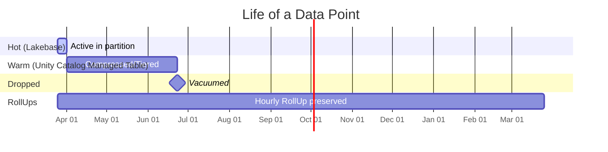

# Life of a sensor reading

This is a worked example. We follow one sensor reading from the moment it lands in Lakebase through every stage of its life — until the raw row is gone but the aggregate it contributed to lives on.

## Day 0 — the write arrives

A sensor sends `cpu = 72.5` at `2026-03-25 14:30:00`:

```sql
INSERT INTO metrics (time, device, cpu)
VALUES ('2026-03-25 14:30:00', 'sensor_42', 72.5);
```

Behind the scenes:

- Postgres routes the row to the day partition `metrics_20260325_000000`
- A trigger fires and copies the row into `_shadow_metrics`
- `wal2delta` reads the WAL change and writes it to the Unity Catalog Managed Table (CDC log)

## Day 0–7 — hot in Lakebase

- Dashboard queries hit the ChronoTable directly in under 10 ms
- The hourly RollUp includes the reading immediately
- `SELECT * FROM _rollup_rt_metrics_hourly` shows it in real time

## Day 7 — compression job runs

- The chunk is now 7 days old; `_get_chunks_to_compress()` returns it
- Chunk status flips from `active` → `compressed`
- The partition is dropped from Lakebase; the data is already in the Unity Catalog Managed Table

## Day 7–90 — warm in Unity Catalog

- Queryable via Lakehouse Federation (100 ms – 1 s)
- The hourly RollUp Table still has the aggregation — unaffected by tiering
- The UC Managed Table is Z-ordered for fast time-range scans

## Day 90 — retention job runs

- Chunk metadata status flips to `dropped`
- The UC Managed Table is vacuumed
- The raw data point is gone forever

## Forever — the RollUp persists

- The `14:00–15:00` bucket for `sensor_42` on Mar 25 still exists in `_rollup_metrics_hourly`
- `avg(cpu)` for that bucket is preserved indefinitely



## See also

- [How ChronoTables Work](../guides/how-it-works/chronotables.md)
- [How RollUps Work](../guides/how-it-works/rollups.md)
- [How Lakebase CDF Works](../guides/how-it-works/lakebase-cdf-internals.md)
- [Data lifecycle policies (how-to)](../how-to/lifecycle.md)
