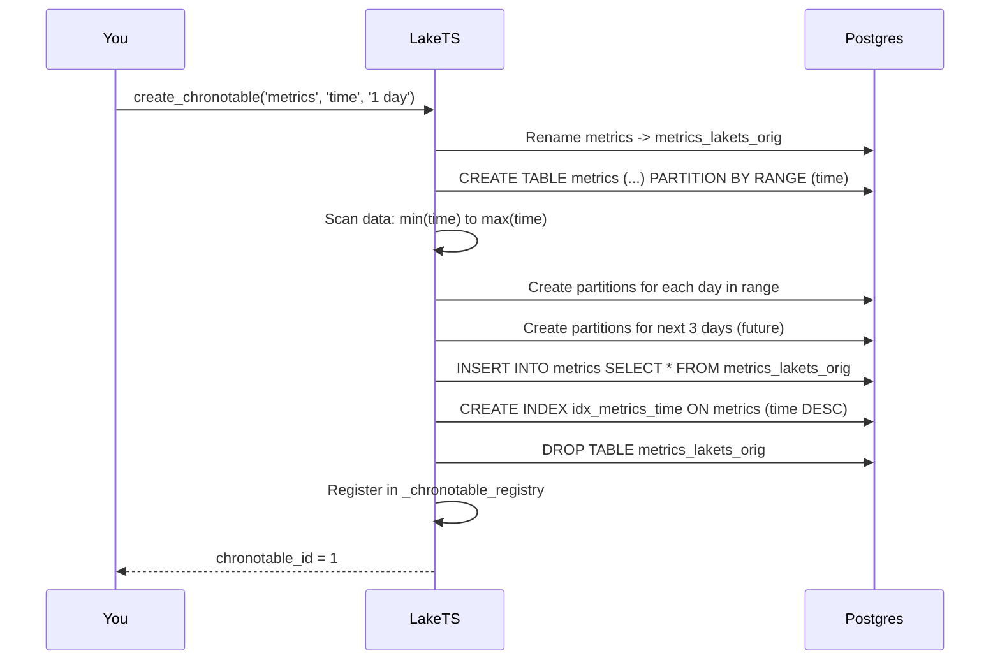

# How ChronoTables Work

## The concept

A ChronoTable (called "hypertable" in V1) looks like a regular table but is secretly split into many smaller tables called **chunks** — one per time interval (e.g., one per day).

```
metrics (what you see)
  |
  +-- metrics_20260320_000000  (Mar 20 data)
  +-- metrics_20260321_000000  (Mar 21 data)
  +-- metrics_20260322_000000  (Mar 22 data)
  +-- metrics_20260323_000000  (Mar 23 data)  <-- today
  +-- metrics_20260324_000000  (Mar 24 data)  <-- pre-created for tomorrow
```

**Why chunks matter**:
- **Inserts are fast**: new data only touches the latest chunk, not the whole table
- **Queries are fast**: Postgres automatically skips chunks outside your time range (partition pruning)
- **Dropping old data is instant**: drop a chunk = drop a table (no slow `DELETE`)

## Under the hood

When you call `create_chronotable('metrics', 'time', '1 day')`, here's what happens:



:::info Key detail
LakeTS scans your existing data to figure out how far back partitions need to go. If your data spans 10 days, it creates 10 past partitions + 3–5 future ones.
:::

## The metadata

LakeTS tracks everything in two tables:

```sql
-- Which tables are ChronoTables?
SELECT * FROM lakets._chronotable_registry;
-- id | schema | table   | time_column | chunk_interval | tiering_enabled | sync_enabled
-- 1  | public | metrics | time        | 1 day          | false           | false

-- What chunks exist?
SELECT * FROM lakets._chunk_metadata;
-- id | chronotable_id | chunk_name                    | range_start | range_end   | status
-- 1  | 1             | public.metrics_20260320_000000| 2026-03-20  | 2026-03-21  | active
-- 2  | 1             | public.metrics_20260321_000000| 2026-03-21  | 2026-03-22  | active
```
