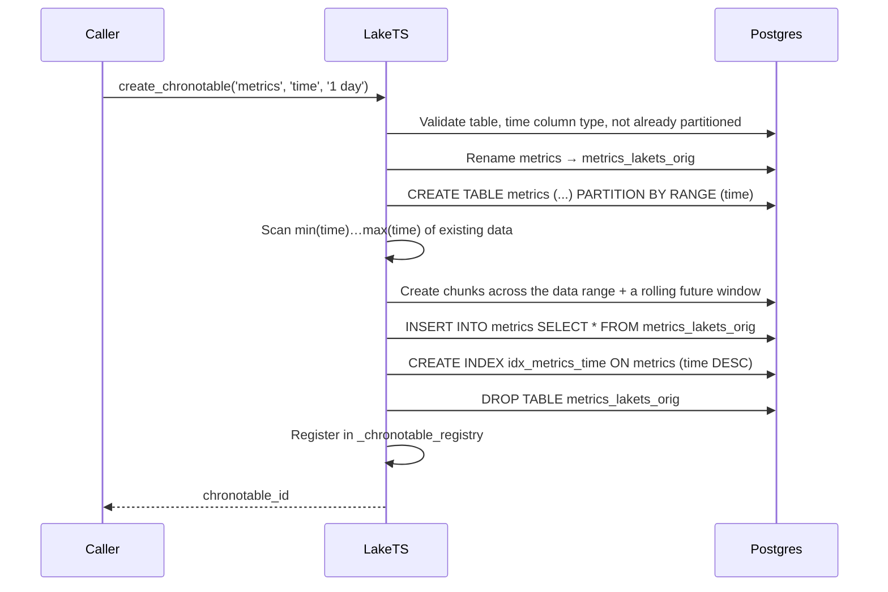

import useBaseUrl from '@docusaurus/useBaseUrl';

export const Demo = ({src, poster}) => (
  <video autoPlay loop muted playsInline poster={useBaseUrl(poster)}
    style={{ width: '100%', borderRadius: '0.75rem', margin: '1.25rem 0', border: '1px solid rgba(127,127,127,0.18)' }}>
    <source src={useBaseUrl(src)} type="video/mp4" />
  </video>
);

# How ChronoTables work

A ChronoTable is a regular PostgreSQL table partitioned by time. It presents a single logical table while storing data in many smaller physical tables — **chunks** — one per time interval:

```text
metrics (logical table)
  ├── metrics_20260320_000000   (Mar 20)
  ├── metrics_20260321_000000   (Mar 21)
  ├── metrics_20260322_000000   (Mar 22)
  ├── metrics_20260323_000000   (Mar 23, current)
  └── metrics_20260324_000000   (Mar 24, pre-created)
```

Partitioning by time buys three properties:

- **Fast inserts** — new rows touch only the current chunk's indexes, not one index spanning the entire history.
- **Fast queries** — Postgres prunes chunks outside the query's time range, so a one-hour query never scans a year of data.
- **Cheap eviction** — removing old data is a `DROP TABLE` on a chunk, a metadata operation, rather than a row-by-row `DELETE`.

## Routing and pruning

Postgres declarative `RANGE` partitioning routes each insert to the chunk whose bounds cover its timestamp, and prunes non-matching chunks when a query filters on time.

<Demo src="/video/chrono-routing.mp4" poster="/video/chrono-routing-poster.png" />

A row whose timestamp falls outside every existing chunk is rejected, which is why chunks must be created ahead of the write stream — the role of `_ensure_partitions` and the [Partition Manager job](../../reference/workflow-jobs.md).

## Creating a ChronoTable

`create_chronotable('metrics', 'time', '1 day')` converts an existing table in place (the default chunk interval is `7 days`):



The conversion scans the existing data range to decide how many historical chunks to create, then lays down a small rolling window around the present (one past chunk and several future chunks) so writes have somewhere to land immediately. Column definitions are reconstructed from the catalog; because a column `DEFAULT` is raw SQL that cannot be parameterized, any default containing `;`, `--`, or `/*` is rejected to prevent injection.

`partition_manager` keeps that future window provisioned as time advances:

<Demo src="/video/partitioning.mp4" poster="/video/partitioning-poster.png" />

## Managing chunks

| Function | Purpose |
| --- | --- |
| `show_chunks('metrics')` | Lists active chunks with range, status, row count, and size |
| `set_chunk_interval('metrics', '1 hour')` | Changes the interval for **future** chunks; existing chunks are unchanged |
| `drop_chunks('metrics', '90 days')` | Drops `active` chunks older than the interval (per-chunk `DROP TABLE`) |
| `drop_chronotable('metrics')` | Full teardown — RollUps, LVC, CDF shadow, registries, then the partitioned table |

## Metadata

Two registry tables track ChronoTable state:

```sql
-- Registered ChronoTables
SELECT schema_name, table_name, time_column, chunk_interval, tiering_enabled, sync_enabled
FROM lakets._chronotable_registry;

-- Chunks and their lifecycle status
SELECT chunk_name, range_start, range_end, status, row_count, size_bytes
FROM lakets._chunk_metadata;
-- status is one of: active, tiered, dropped
```

`_chunk_metadata` also carries `last_write_lsn` — the WAL position of each chunk's most recent write, stamped by the tiering write-tracking triggers and used by the [durability gate](./tiering-and-retention.md#the-durability-gate).
