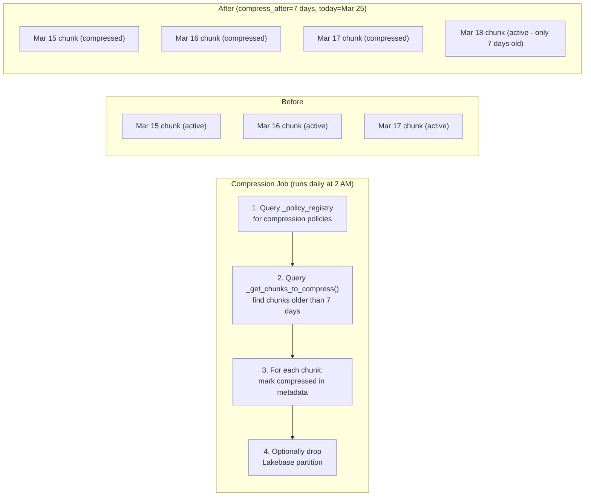

# How Compression & Tiering Works

## The concept

Think of your data like files on a desk:
- **Hot desk** (Lakebase): Papers you're actively reading. Fast access.
- **Filing cabinet** (Unity Catalog Managed Table): Papers from last month. Slower but organized.
- **Shredder** (Retention): Papers older than a year. Gone.

## How policies work

When you add a compression policy, LakeTS stores the rule in `_policy_registry`:

```sql
SELECT lakets.add_compression_policy('metrics', '7 days');
-- Stores: {compress_after: "7 days", segment_by: null, order_by: "time DESC"}
```

Nothing happens immediately. The policy is a **declaration of intent**. The actual work is done by the Databricks compression job that runs on a schedule:



The data in the Unity Catalog Managed Table is already there (via Lakebase CDF). The compression job's main purpose is to **free Lakebase storage** by dropping old partitions once we know the data is safely in the cold tier.

---

# How Retention Works

Retention is simpler than compression — it just drops old chunks:

```sql
SELECT lakets.add_retention_policy('metrics', '30 days');
```

When `execute_retention` runs:

1. Looks up the policy in `_policy_registry`
2. Calls `drop_chunks('metrics', '30 days')` which:
   - Finds chunks where `range_end <= now() - 30 days`
   - Runs `DROP TABLE` on each partition (instant, no row-by-row delete)
   - Updates `_chunk_metadata` status to `dropped`

**Tiered retention** adds a two-step lifecycle:

```
Day 0-7:    HOT (Lakebase, fast queries)
Day 7-90:   WARM (Unity Catalog Managed Table, tiered via compression policy)
Day 90+:    DELETED (retention policy drops from both tiers)
```

:::tip RollUps survive retention
You can drop all raw data older than 30 days while keeping your hourly/daily RollUp tables forever.
:::
