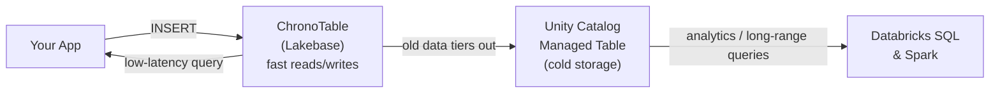

# How LakeTS Works

A deep dive into how LakeTS turns Databricks Lakebase into a full-featured time series database — explained simply.

Start here for the high-level picture, then follow the topic pages for each subsystem:

- **[ChronoTables](./chronotables.md)** — how time-partitioned tables work under the hood
- **[Time series functions](./time-series-functions.md)** — `time_bucket`, `first`, `locf`, `interpolate`, `delta`, `rate`, `gapfill`
- **[RollUps](./rollups.md)** — incremental aggregates, DAG cascade, scale optimizations (chunk-skip pruning, batch refresh, Unity Catalog export)
- **[Tiering & retention](./tiering-and-retention.md)** — lifecycle policies, the CDF durability gate, and chunk drops
- **[Lakebase CDF internals](./lakebase-cdf-internals.md)** — shadow tables, triggers, CDC routing

## The problem

Imagine you're collecting temperature readings from 1,000 sensors every second. That's **86 million rows per day**. After a year, you have 31 billion rows.

Plain PostgreSQL struggles with this because:

- **Inserts slow down** as the table grows (indexes get huge)
- **Queries scan everything** even when you only want the last hour
- **No easy way to archive old data** without manual partition management
- **Common patterns** like "average temperature per hour with gap-filling" require complex SQL

LakeTS solves this by adding a time series layer on top of Postgres — purpose-built for Databricks Lakebase, with the added benefit of tiering cold data to a Unity Catalog Managed Table.

## The big picture

LakeTS has two paths for your data:

Recent data is read straight from Lakebase over Postgres. As data ages, the tiering job validates that it is durable in the Unity Catalog Managed Table and flags the chunk `tiered` — at this point the partition is still resident in Lakebase. Later, the retention job drops the partition once it ages past `drop_after`. The cold copy is queried in Databricks (Databricks SQL, Spark, dashboards) as an ordinary Delta table. The two tiers are queried independently in their own engines; LakeTS does not federate the cold table back into Lakebase.

| Path | Where | Speed | Cost | What lives here | Queried with |
|------|-------|-------|------|-----------------|--------------|
| **Hot** | Lakebase (Postgres) | < 10ms | Higher | Recent data (days to weeks) | Postgres / SQL clients |
| **Cold** | Unity Catalog Managed Table | 100ms–1s | Lower | Historical data (weeks to years) | Databricks SQL / Spark |

:::tip Key insight
Most time series queries care about recent data. By keeping only recent data in the fast Postgres layer and archiving the rest to a Unity Catalog Managed Table, you get the best of both worlds.
:::

## Summary — Postgres primitives used

LakeTS is built from these Postgres primitives — no custom extensions:

| LakeTS Feature | Built With |
|----------------|-----------|
| ChronoTables | `PARTITION BY RANGE` + metadata tables |
| Time series functions | `PL/pgSQL` functions + `CREATE AGGREGATE` |
| Gap-filling | `generate_series()` + `LEFT JOIN` |
| RollUps | Regular `TABLE` + incremental refresh + `UNION ALL` view |
| RollUp optimization | Chunk-skip pruning, batch `ANY(array)`, Kahn's toposort, transition tables |
| Tiering | `_policy_registry` + Databricks Jobs + CDF durability gate |
| Retention | `DROP TABLE` on expired partitions |
| Lakebase CDF | Shadow table + trigger + `wal2delta` CDC |
| Monitoring | SQL functions over `pg_stat_*` + metadata |

No magic. No custom extensions. Just smart composition of standard Postgres features + Unity Catalog integration.
