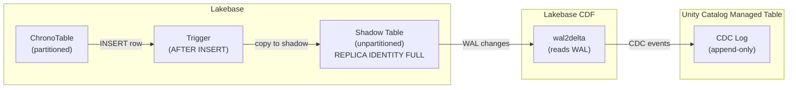

# How Lakebase CDF Works

## The challenge

Lakebase CDF (built on `wal2delta`) streams changes from Lakebase into a Unity Catalog Managed Table via CDC. But it has a limitation: **it doesn't support partitioned tables**.

Since ChronoTables are partitioned, we can't sync them directly.

## The shadow table solution

LakeTS creates an unpartitioned "shadow" table that mirrors all writes:



## The trigger problem (and fix)

When you create a trigger on a partitioned table in Postgres, the trigger actually fires on the **child partitions**, not the parent. So `TG_TABLE_NAME` returns something like `metrics_20260325_000000` instead of `metrics`.

The trigger function needs to figure out which ChronoTable the partition belongs to:

```sql
-- Inside the trigger function:
-- 1. Look up the parent table via pg_inherits
SELECT parent.relname INTO v_parent
FROM pg_inherits i
JOIN pg_class child ON i.inhrelid = child.oid
JOIN pg_class parent ON i.inhparent = parent.oid
WHERE child.relname = TG_TABLE_NAME;  -- e.g., 'metrics_20260325_000000'
-- v_parent = 'metrics'

-- 2. Find the shadow table for this parent
SELECT shadow_table_name INTO v_shadow
FROM lakets._chronotable_registry
WHERE table_name = v_parent;  -- 'metrics' -> '_shadow_metrics'

-- 3. Forward the row
INSERT INTO _shadow_metrics SELECT NEW.*;
```
