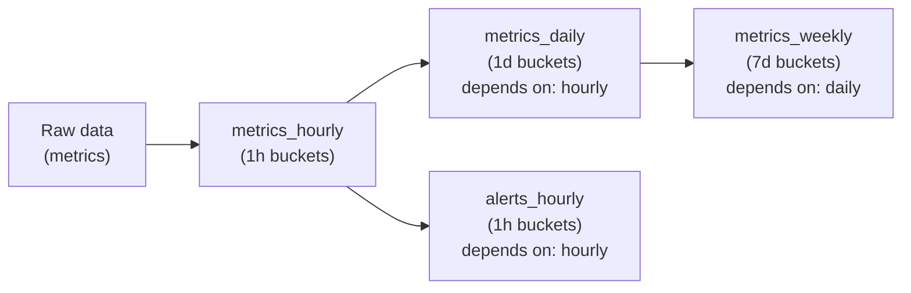
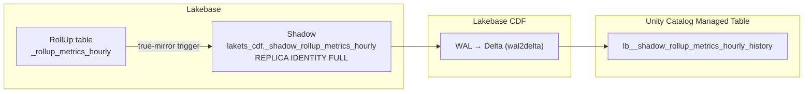
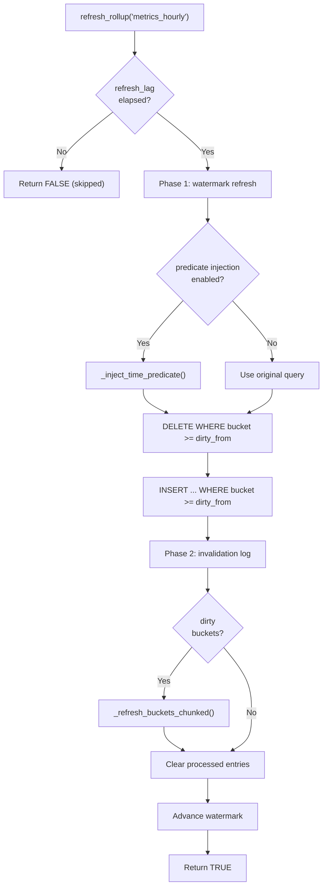

import useBaseUrl from '@docusaurus/useBaseUrl';

export const Demo = ({src, poster}) => (
  <video autoPlay loop muted playsInline poster={useBaseUrl(poster)}
    style={{ width: '100%', borderRadius: '0.75rem', margin: '1.25rem 0', border: '1px solid rgba(127,127,127,0.18)' }}>
    <source src={useBaseUrl(src)} type="video/mp4" />
  </video>
);

# How RollUps work

Dashboards run the same aggregation repeatedly:

```sql
SELECT lakets.time_bucket('1 hour'::interval, time) AS bucket, avg(cpu), count(*)
FROM metrics WHERE time > now() - '7 days' GROUP BY 1;
```

At 100M rows this query takes seconds, and dashboards run it constantly. Ten panels refreshing every 30 seconds issue roughly 1,200 identical scans per hour, each reading the full seven-day window — even though most of those rows have not changed since the previous scan. A RollUp computes the aggregation once and serves it from a small pre-aggregated table, recomputing only the buckets that actually change.

## RollUp objects

A **RollUp** is an incrementally-maintained, time-bucketed aggregation table. Unlike a materialized view, which must be fully rebuilt, a RollUp is a regular table that supports per-bucket `DELETE` + `INSERT`, so only changed time buckets are recomputed.

`create_rollup` establishes three objects:

1. **RollUp table** (`_rollup_<name>`, in `public`): a regular table holding the pre-computed aggregation, with a unique index across all result columns to support per-bucket replacement. The bucket column is auto-detected as the first timestamp column in the query.
2. **Real-time view** (`_rollup_rt_<name>`): a `UNION ALL` of the RollUp table and a query for source data newer than the watermark. `create_rollup` reserves the view name; `create_rollup_view` builds the view from a supplied raw query that filters above `lakets._rollup_watermark('<name>')`.
3. **Registry entry** in `_rollup_registry`: tracks the name, source ChronoTable, bucket interval, query text, watermark, and dependencies.

## Incremental refresh and the watermark

The **watermark** is the most recent fully-materialized bucket. A query against the real-time view reads pre-aggregated buckets up to the watermark and aggregates only the small live tail beyond it; the two halves are combined with `UNION ALL`.

<Demo src="/video/rollup-refresh.mp4" poster="/video/rollup-refresh-poster.png" />

`refresh_rollup('<name>')` advances the materialized region:

```text
Before refresh:
  RollUp table materialized up to 14:00 (watermark)
  Raw table has data up to 15:37

  refresh_rollup('metrics_hourly'):
    1. Compute the dirty window: watermark - one bucket_interval (13:00)
    2. DELETE FROM _rollup_metrics_hourly WHERE bucket >= 13:00
    3. INSERT INTO _rollup_metrics_hourly SELECT ... WHERE bucket >= 13:00
    4. Process any historical dirty buckets from the invalidation log
    5. Advance the watermark to 15:00

After refresh:
  RollUp table materialized up to 15:00
```

The dirty window overlaps the watermark by exactly one bucket interval, so the bucket straddling the boundary is always recomputed rather than left half-aggregated. Each refresh takes an advisory lock to serialize concurrent runs, and self-gates on `refresh_lag` (default one hour) — a scheduled refresh that fires inside the lag window returns without doing work.

## Invalidation of historical buckets

Watermark refresh covers append-only data. When historical rows change — late-arriving corrections, backfills — the affected buckets must be re-aggregated. LakeTS tracks this with an invalidation log and two triggers on the source ChronoTable:

- A **per-row trigger** handles `UPDATE` and `DELETE`. For each affected row it computes the bucket with `date_bin(bucket_interval, time, '2000-01-01')` and records it in `_rollup_invalidation_log`.
- A **statement-level trigger** handles `INSERT`, including `COPY FROM` and `INSERT ... SELECT`, which bypass per-row triggers. It reads the inserted range from the `NEW` transition table and invalidates the affected buckets below the watermark.

<Demo src="/video/rollup-invalidation.mp4" poster="/video/rollup-invalidation-poster.png" />

On the next `refresh_rollup()`, the dirty buckets recorded in the log are re-aggregated individually and then cleared — the rest of the table is untouched.

## Refresh from Lakebase-resident data

RollUp tables persist in Lakebase permanently; aggregates are tiny compared to raw data. The raw **source** data does not: the [tiering job](../../reference/workflow-jobs.md) validates durability and flags cold chunks `tiered` once Lakebase CDF has flushed them to the Unity Catalog Managed Table, and the retention job later drops those partitions from Lakebase.

RollUps are maintained entirely from Lakebase-resident source data. A chunk's status determines whether its buckets can still be refreshed:

| Chunk status | Source data in Lakebase? | Refreshable? |
|---|---|---|
| `active` | yes (recent) | yes — re-aggregated in place |
| `tiered` | yes (validated in UC, not yet dropped) | yes — re-aggregated in place |
| `dropped` | no — only in Unity Catalog | no — bucket stays frozen |

Both `active` and `tiered` chunks are resident in Lakebase, so their buckets are re-aggregated normally by `refresh_rollup()`. Once a source partition is `dropped`, its rows no longer exist in Postgres, so the covering buckets keep their last computed value. `invalidate_rollup_range('<name>', '<from>', '<to>')` silently skips buckets whose source partition has been dropped — corrections to source data that has already left Lakebase are not re-aggregated. To keep late corrections in scope, size `drop_after` larger than your worst-case data lateness so the window is still resident when the correction lands.

For long-term access to RollUp results from Spark, BI, and ML, sync the RollUp table to Unity Catalog with `enable_sync()` (see [Unity Catalog sync via Lakebase CDF](#unity-catalog-sync-via-lakebase-cdf) below).

---

## Optimizations at scale

The baseline refresh loop re-scans the full source table on every run. At 100M+ rows, or across many hierarchical RollUps, several bottlenecks emerge:

- Full table scans even when only a few chunks changed.
- One `DELETE` + one `INSERT` per dirty bucket (2N statements for N buckets).
- Hierarchical RollUps refreshed in arbitrary order, so a daily RollUp may read stale hourly data.
- `COPY FROM` bypassing per-row triggers, leaving RollUps stale after bulk imports.
- RollUp tables confined to Lakebase, invisible to Spark, BI, and ML.

LakeTS addresses each of these.

### Chunk-skip pruning and predicate injection

The baseline `refresh_rollup()` re-scans the entire source table on every run. LakeTS narrows this to the data that actually changed:

- **Chunk-skip pruning**: `last_modified_at` is tracked per chunk, and `_get_dirty_chunks()` returns only the chunks modified since the last refresh.
- **Predicate injection**: the inner source query is rewritten with a `WHERE time >= dirty_from` clause so Postgres prunes partitions at the scan level.

```text
Before:  SELECT ... FROM metrics GROUP BY 1                       -- scans all partitions
After:   SELECT ... FROM metrics WHERE time >= '2026-03-25' GROUP BY 1  -- scans 2 of 30
```

Predicate injection runs `EXPLAIN` on the rewritten query first; if the rewrite fails — a complex subquery, for instance — LakeTS falls back to the original query, so a refresh can never be corrupted by the optimization.

### Batch bucket refresh

The invalidation phase originally ran a loop of one `DELETE` + one `INSERT` per dirty bucket — 2N statements for N buckets. LakeTS batches dirty buckets into a single `ANY(array)` predicate:

```sql
DELETE FROM _rollup_hourly WHERE bucket = ANY(dirty_buckets_array);
INSERT INTO _rollup_hourly SELECT * FROM (query) WHERE bucket = ANY(dirty_buckets_array);
```

For large dirty sets, `_refresh_buckets_chunked()` splits the array into batches of 100 to avoid planner degradation.

### Dependency-ordered refresh

Hierarchical RollUps (hourly → daily → weekly) must refresh in dependency order, or a daily RollUp reads stale hourly data. Dependencies are stored in a `depends_on` column; `refresh_rollup_cascade()` performs a topological sort (Kahn's algorithm, with cycle detection) and refreshes children before parents in a single pass.



```sql
-- Refresh all RollUps in dependency order
SELECT * FROM lakets.refresh_rollup_cascade('metrics_weekly');
-- rollup_name      | refreshed | refresh_ms
-- metrics_hourly   | true      | 12.5
-- metrics_daily    | true      | 8.3
-- metrics_weekly   | true      | 5.1

-- Inspect the dependency graph
SELECT * FROM lakets.show_rollup_dag();
```

Each RollUp still self-gates on its `refresh_lag`, so a `refreshed = false` row in the cascade output is expected when nothing in that RollUp has aged past the lag.

### Bulk-import invalidation

`COPY FROM` and multi-row `INSERT ... SELECT` bypass per-row triggers, which would leave RollUps stale after a bulk import. A statement-level `AFTER INSERT` trigger using `REFERENCING NEW TABLE` exposes every inserted row as a transition table, reads the inserted time range once, and invalidates the affected buckets:

```text
COPY metrics FROM 'sensor_data.csv';   -- 50,000 rows
  -> statement-level trigger fires once
  -> reads min(time), max(time) from the transition table
  -> invalidates the affected RollUp buckets below the watermark
```

The per-row trigger handles `UPDATE` and `DELETE`; the statement-level trigger handles `INSERT`, including `COPY`.

### Unity Catalog sync via Lakebase CDF

RollUp tables live in Lakebase, but downstream consumers — BI, Spark, ML — typically read from Unity Catalog. `enable_sync()` creates an unpartitioned shadow in `lakets_cdf` and Lakebase CDF streams it continuously to a Unity Catalog Managed Table:



See [Lakebase CDF internals](./lakebase-cdf-internals.md) for the shadow and mirror mechanics. Use `disable_sync()` to stop the sync; the Unity Catalog table is left in place.

## The refresh_rollup() pipeline


