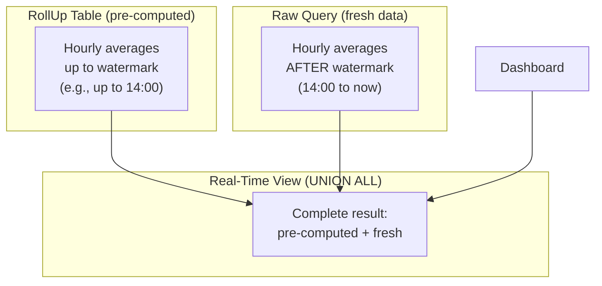
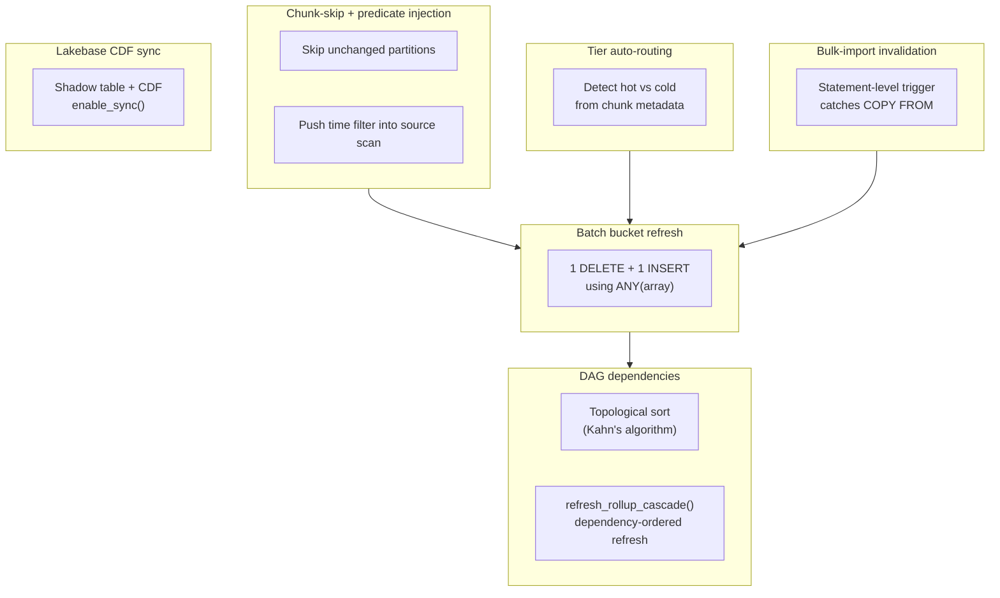
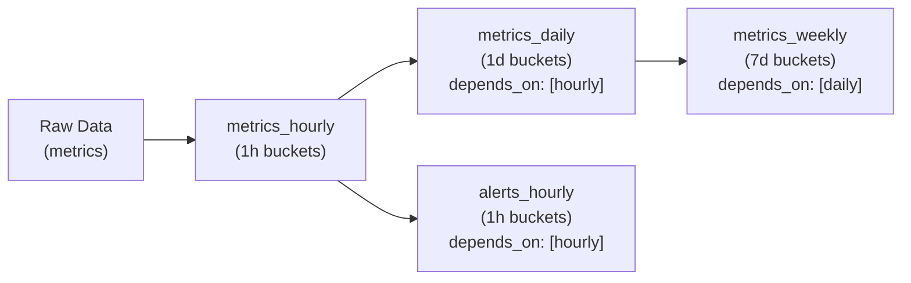
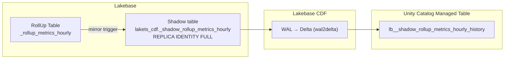
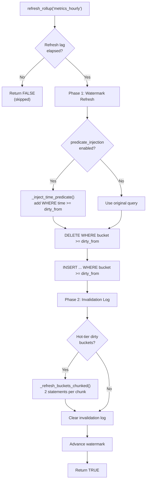

# How RollUps Work

## The problem

Dashboards query the same aggregations repeatedly:

```sql
SELECT lakets.time_bucket('1 hour'::interval, time) AS bucket, avg(cpu), count(*)
FROM metrics WHERE time > now() - '7 days' GROUP BY 1;
```

With 100M rows, this takes seconds every time. Stack it up:

- 10 dashboard panels × 30-second refresh → 1,200 identical scans per hour
- Each scan reads every row in the last 7 days
- Most of those rows haven't changed since the previous scan

Your database is constantly doing the same expensive work.

## The solution: incremental RollUps

A **RollUp** is an incrementally-maintained, time-bucketed aggregation table. Unlike a materialized view (which must be fully rebuilt), a RollUp is a regular table that supports surgical per-bucket DELETE + INSERT — only dirty time buckets are recomputed.



**Three objects are created**:

1. **RollUp Table** (`_rollup_<name>`): A regular table storing pre-computed aggregations. Supports per-bucket updates via unique index on all columns.
2. **Real-Time View** (`_rollup_rt_<name>`): A `UNION ALL` of the RollUp Table + a query for data newer than the watermark.
3. **Registry entry** in `_rollup_registry`: Tracks the RollUp name, bucket interval, watermark, and last refresh time.

## How incremental refresh works

The **watermark** is the `bucket_start` of the most recent fully-materialized time bucket.

```
Before refresh:
  RollUp Table has data up to 14:00 (watermark)
  Raw table has data up to 15:37

  refresh_rollup('metrics_hourly'):
    1. DELETE FROM _rollup_metrics_hourly WHERE bucket >= 13:00  (watermark - 1 bucket)
    2. INSERT INTO _rollup_metrics_hourly SELECT ... WHERE bucket >= 13:00
    3. Process invalidation log (historical dirty buckets, if any)
    4. Advance watermark to 15:00

After refresh:
  RollUp Table has data up to 15:00
  Watermark = 15:00

  Query _rollup_rt_metrics_hourly:
    = [RollUp Table: buckets up to 15:00]
      UNION ALL
      [raw query: data from 15:00 to 15:37]
```

Only the dirty window (one bucket overlap for safety) is recomputed — not the entire dataset.

## How invalidation works (historical mutations)

For append-only workloads, watermark-based refresh is sufficient. But if historical data is updated (e.g., late-arriving corrections), the affected time buckets must be re-aggregated.

LakeTS uses an **invalidation trigger** that watches for INSERT, UPDATE, and DELETE on the source ChronoTable. For each affected row, the trigger:

1. Resolves the parent table (partitions fire triggers with the child table name)
2. Computes the dirty bucket via `date_bin(bucket_interval, time_value, '2000-01-01')`
3. Upserts into `_rollup_invalidation_log` with `tier = 'hot'`

On the next `refresh_rollup()` call, all hot-tier invalidation entries older than the watermark are processed — each dirty bucket is individually DELETE + INSERT'd — and the log is cleared.

## Hot-tier vs cold-tier refresh

RollUp Tables persist in Lakebase permanently (aggregates are tiny compared to raw data). When raw data tiers to a Unity Catalog Managed Table:

| Tier | Data Location | Refresh Engine | How It Works |
|------|--------------|----------------|--------------|
| **Hot** | Lakebase (Postgres) | `refresh_rollup()` SQL function | Watermark + invalidation log, runs every 15 min |
| **Cold** | Unity Catalog Managed Table | `cold_rollup_refresh.py` Databricks job | Reads cold invalidation entries, re-aggregates via Databricks SQL, writes back to Lakebase |

Cold-tier invalidation is triggered manually via `invalidate_rollup_range()` with `tier = 'cold'` — typically after ETL corrections or bulk re-imports into the Unity Catalog Managed Table.

---

# RollUp optimizations at scale

The core refresh loop above is correct but naive. Once you're running 100M+ rows or many hierarchical RollUps, several bottlenecks appear:

- Full table scans even when only a few chunks changed
- One `DELETE` + one `INSERT` per dirty bucket (2N statements for N buckets)
- Hierarchical RollUps refreshed in arbitrary order, so a daily RollUp may read stale hourly data
- Manual `tier = 'hot' | 'cold'` arguments on invalidation calls
- `COPY FROM` bypasses per-row triggers, so bulk imports leave RollUps stale
- RollUp Tables stuck in Lakebase, invisible to Spark / BI / ML

LakeTS addresses each of these:



## Chunk-skip pruning + predicate injection — "only scan what changed"

The default `refresh_rollup()` re-scanned the whole source table every run. LakeTS now combines two optimizations:

- **Chunk-skip pruning**: `last_modified_at` is tracked per chunk. `_get_dirty_chunks()` returns only the chunks that changed since the last refresh.
- **Predicate injection**: the inner source query is rewritten with a `WHERE time >= dirty_from` clause so Postgres can prune partitions at the scan level.

```
Before:
  refresh_rollup('metrics_hourly')
    -> SELECT ... FROM metrics GROUP BY 1     -- scans ALL partitions
    -> 500ms for 100M rows

After:
  refresh_rollup('metrics_hourly')
    -> _get_dirty_chunks()                    -- only 2 of 30 chunks modified
    -> _inject_time_predicate()               -- adds WHERE time >= '2026-03-25'
    -> SELECT ... FROM metrics WHERE time >= '2026-03-25' GROUP BY 1
    -> 15ms (scans 2 partitions)
```

Predicate injection runs `EXPLAIN` on the rewritten query first; if the rewrite fails (e.g. complex subquery), LakeTS falls back to the original query — no risk of corruption.

## Batch bucket refresh — "2 statements instead of 2N"

The original invalidation-log phase ran a `FOR` loop: one `DELETE` + one `INSERT` per dirty bucket. With 50 dirty buckets that's 100 SQL statements per refresh.

LakeTS now batches dirty buckets into a single `ANY(array)` predicate:

```sql
-- Before: 2N statements (sequential loop)
FOR each bucket IN dirty_buckets LOOP
    DELETE FROM _rollup_hourly WHERE bucket = bucket_val;
    INSERT INTO _rollup_hourly SELECT ... WHERE bucket = bucket_val;
END LOOP;

-- After: 2 statements (batch)
DELETE FROM _rollup_hourly WHERE bucket = ANY(dirty_buckets_array);
INSERT INTO _rollup_hourly SELECT * FROM (query) WHERE bucket = ANY(dirty_buckets_array);
```

For very large dirty sets (>100 buckets), `_refresh_buckets_chunked()` splits the array into smaller batches to avoid Postgres planner degradation.

## DAG dependencies — "refresh in the right order"

Hierarchical RollUps (hourly → daily → weekly) must refresh in dependency order, otherwise a daily RollUp reads stale hourly data.

LakeTS stores dependencies in a `depends_on` column. `_build_rollup_dag()` performs a topological sort (Kahn's algorithm) with cycle detection, then refreshes in that order.



```sql
-- Refresh all RollUps in dependency order
SELECT * FROM lakets.refresh_rollup_cascade('metrics_weekly');
-- Returns:
-- rollup_name      | refreshed | refresh_ms
-- metrics_hourly   | true      | 12.5
-- metrics_daily    | true      | 8.3
-- metrics_weekly   | true      | 5.1

-- View the DAG
SELECT * FROM lakets.show_rollup_dag();
```

## Tier auto-routing — "hot vs cold detected automatically"

Originally, `invalidate_rollup_range()` required a `tier = 'hot' | 'cold'` argument. Callers had to know which chunks had already tiered to the Unity Catalog Managed Table.

The default now resolves the tier from the chunk's status:

| Chunk status | Resolved tier | Meaning |
|---|---|---|
| `active` | hot | Data in Lakebase |
| `tiered` | cold | Data in Unity Catalog Managed Table |

You can still pass `p_tier` explicitly when you need to override.

## Bulk-import invalidation — "catch COPY FROM"

Postgres's `COPY FROM` and multi-row `INSERT INTO ... SELECT` bypass per-row triggers. Before this fix, bulk imports left RollUps stale until the next watermark refresh.

The fix is a statement-level `AFTER INSERT` trigger using `REFERENCING NEW TABLE AS _new_rows` — a Postgres feature that exposes every inserted row as a transition table:

```
COPY metrics FROM 'sensor_data.csv';
  -> 50,000 rows inserted
  -> Statement-level trigger fires ONCE
  -> SELECT min(time), max(time) FROM _new_rows
  -> Calls invalidate_rollup_range(min_time, max_time)
  -> All affected RollUp buckets marked dirty
```

Both triggers coexist:

- The per-row trigger handles `UPDATE` and `DELETE`.
- The statement-level trigger handles `INSERT` (including `COPY`).

## Lakebase CDF sync — "RollUp Tables visible to Spark / BI / ML"

RollUp Tables live in Lakebase. Downstream consumers (BI dashboards, Spark jobs, ML pipelines) typically read from Unity Catalog instead.

`enable_sync()` sets up a shadow in `lakets_cdf` and Lakebase CDF replicates it continuously to a Unity Catalog Managed Table:



The UC destination is an append-only change feed. Use `disable_sync()` to stop replication (the UC table is not dropped).

## What `refresh_rollup()` does end to end


