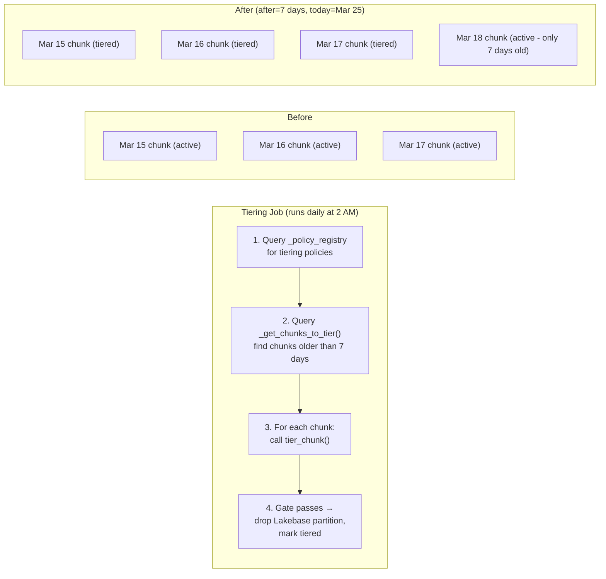

# How Tiering Works

## The concept

Think of your data like files on a desk:
- **Hot desk** (Lakebase): Papers you're actively reading. Fast access.
- **Filing cabinet** (Unity Catalog Managed Table): Papers from last month. Slower but organized.
- **Shredder** (Retention): Papers older than a year. Gone.

## How policies work

A tiering policy marks chunks older than `p_after` for eviction. The data is already in the Unity Catalog Managed Table via Lakebase CDF; the policy's job is to free Lakebase storage by dropping the old partitions once the data is safely cold.

When you add a tiering policy, LakeTS stores the rule in `_policy_registry`:

```sql
SELECT lakets.add_tiering_policy('metrics', '7 days');
-- Stores: {after: "7 days"} with policy_type = 'tiering'
```

Nothing happens immediately. The policy is a **declaration of intent**. The actual work is done by the Databricks Tiering Job that runs on a schedule:



The data in the Unity Catalog Managed Table is already there (via Lakebase CDF). The Tiering Job's main purpose is to **free Lakebase storage** by dropping old partitions once we know the data is safely in the cold tier.

## CDF is a prerequisite

Tiering can only evict a chunk once Lakebase CDF has durably copied that chunk's data into the Unity Catalog Managed Table. CDF must be enabled (on the `lakets_cdf` schema, via Databricks) **before** tiering can drop anything — LakeTS cannot enable CDF itself, and a table must be CDF-synced via `lakets.enable_sync('<table>')`.

`add_tiering_policy` still creates the policy if the table isn't synced yet (it emits a NOTICE), but nothing will be evicted until sync and CDF are live. See [Lakebase CDF Setup](../lakebase-cdf-setup.md) for how to turn CDF on.

## The durability gate

`tier_chunk` drops a chunk's partition only when **both** of these hold:

1. The chunk's CDF **shadow table** (in schema `lakets_cdf`) is `STREAMING` in `wal2delta.tables`, **and**
2. CDF's `committed_lsn` for that shadow is **>= the chunk's own `last_write_lsn`** (the WAL position of the chunk's most recent write).

In plain terms: this proves Lakebase CDF has durably flushed every write to that chunk into the Unity Catalog Managed Table **before** the partition is dropped.

The comparison is against the **chunk's own recorded write position**, not the global WAL head. A per-table `committed_lsn` does not advance while that shadow is idle — but the global WAL head keeps moving from unrelated activity, so a head comparison would never pass for a cold (idle) chunk. Per-chunk write positions are stamped automatically by triggers that are installed when you add a tiering policy.

The gate is **fail-closed**. If it isn't satisfiable — CDF isn't streaming, or hasn't yet flushed past the chunk — `tier_chunk` defers and the chunk is retried on the next job run. A missing, degraded, or lagging CDF can never read as "safe to drop".

`tier_chunk` returns `TRUE` when it dropped the partition and `FALSE` when it deferred.

---

# How Retention Works

Retention is simpler than tiering — it just drops old chunks:

```sql
SELECT lakets.add_retention_policy('metrics', '30 days');
```

When `execute_retention` runs:

1. Looks up the policy in `_policy_registry`
2. Calls `drop_chunks('metrics', '30 days')` which:
   - Finds chunks where `range_end <= now() - 30 days`
   - Runs `DROP TABLE` on each partition (instant, no row-by-row delete)
   - Updates `_chunk_metadata` status to `dropped`

**Tiered retention** adds a two-step lifecycle:

```
Day 0-7:    HOT (Lakebase, fast queries)
Day 7-90:   WARM (Unity Catalog Managed Table, evicted via tiering policy)
Day 90+:    DELETED (retention policy drops from both tiers)
```

:::tip RollUps survive retention
You can drop all raw data older than 30 days while keeping your hourly/daily RollUp tables forever.
:::
